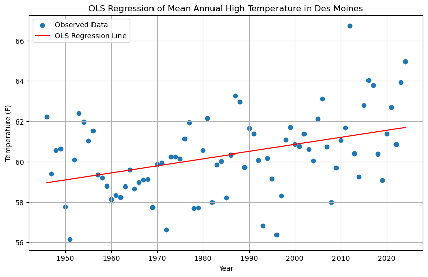

# Earth Data Analytics Portfolio
These projects were completed as part of **GEOG 4463: Earth Analytics Data Science Bootcamp**, a course at CU Boulder.
# **Impact of the 2020 Midwest Derecho on Vegetation Health in Backbone State Park, Iowa**
Backbone State Park, established in 1920 as Iowa's first state park, is a geographically unique and ecologically significant natural preserve [1]. On August 10, 2020, the park and the surrounding Midwest were struck by a powerful and deadly derecho, causing billions in damage and killing 4 people [2]. A *derecho* is a fast-moving band of storms that produce destructive winds and even tornadoes [3]. 
To assess the ecological impact of such a short and intense storm, me must analyze it using geospatial data. This project utilizes the Normalized Difference Vegetation Index (NDVI), a remotely sensed proxy, to quantify the derecho's impact on vegetation health within the park.
The aim of this project is to answer the following question: **How did the 2020 Midwest derecho impact vegetation health inside Backbone State Park?**
### Methods and Results
To answer this question, I compared NDVI data over the park from before (8/4/20) and after (8/11/20) the storm (8/10/20). I imported a GeoDataFrame of Backbone State Park via OSM to define the region of the park. To gather the data I would later use to calculate NDVI, I used the Microsoft Planetary Computer STAC API to search the *Landsat 8 Collection 2 Level 2* catalog for scenes overlapping with the bounds of the park. After running the search, I picked the scene with the lowest cloud cover from before and after the Derecho.
I used the Open Data Cube (ODC) STAC Python package to load each of these 2 scenes as an Xarray dataset. I then calculated NDVI from these datasets, using USGS-defined remote sensing formulae [5]. Next, I plotted the NDVI from the before and after scenes over the bounds of the park boundary, side-by-side:

Finally, to determine whether NDVI changed significantly from before to after the Derecho, I computed the difference in NDVI between 8/11 and 8/4, and plotted it:

### Analysis and Discussion
This plot indicates that NDVI change throughout most of Backbone State Park was fairly minimal between August 4 and August 11, despite the powerful Derecho that hit the park on August 10. This suggests that direct wind damage to the forest canopy was not significant enough to register a perceptible change at the Landsat 30-meter pixel scale.
However, a small region of noticeable NDVI loss is apparent in the southeast corner of the park. Upon further investigation, this region corresponds with *Backbone Lake*, which is an impoundment of the *Maquoketa River*. 
This insight reveals a possible cause of the negative NDVI difference we see: intense rainfall and heavy storm runoff, which could have eroded topsoil and transported it into the Maquoketa River, where it got carried downstream and settled in Backbone Lake.
### Limitations and Future Work
One of the main limitations of this project is that the spatial data used does not capture the full extent of vegetation damage caused by the Derecho. The Landsat 8 images, and the plots derived from them, have a resolution of 30x30 meters [7], which is course enough to miss small pockets of canopy loss. Furthermore, NDVI may fail to distinguish healthy vegetation from vegetation that is physically present but structurally compromised.
In future work, a different remotely sensed index could be used to possibly better quantify vegetation health, such as Normalized Burn Ratio (NBR). The spatial scale of the study could also be expanded to include all of Iowa or the Midwest; this would reveal key insight on how the Derecho affected agriculture.
### References
1. Iowa Department of Natural Resources (DNR). *Backbone State Park*. [View Source](https://www.iowadnr.gov/places-go/state-parks/all-parks/backbone-state-park)
2. NOAA Climate.gov (2020). *2020 Billion-Dollar Weather and Climate Disasters: Midwest Derecho*. [View Source](https://www.climate.gov/disasters2020)
3. NOAA / NESDIS. *What is a Derecho?* [View Source](https://www.nesdis.noaa.gov/about/k-12-education/severe-weather/what-derecho)
4. Esri / ArcGIS Pro. *Introduction to SpatioTemporal Asset Catalogs (STAC)*. [View Source](https://pro.arcgis.com/en/pro-app/latest/help/data/imagery/introduction-to-stac.htm)
5. United States Geological Survey (USGS). *Landsat Collection 2 Level-2 Science Products*. [View Source](https://www.usgs.gov/landsat-missions/landsat-collection-2-level-2-science-products)
6. United States Geological Survey (USGS). *Landsat Normalized Difference Vegetation Index*. [View Source](https://www.usgs.gov/landsat-missions/landsat-normalized-difference-vegetation-index)
7. United States Geological Survey (USGS). *Landsat 8*. [View Source](https://www.usgs.gov/landsat-missions/landsat-8)

***
# Impact of the Restoration of Water Rights to the Gila River Indian Community
In 2004, the Akimel O’otham and Tohono O’odham tribes won a US Supreme Court settlement granting them water rights [1]. Using Normalized difference vegetation index (NDVI) data, we can observe the effects of the restoration of said water rights on vegetation health in the Gila River Reservation, located in southern Arizona. 

The average NDVI in and around the Gila River Indian Community (GRIC) from 2001-2004, alongside that from 2005-2008, are shown below:

To examine the impact of the restoration of water rights to the Gila River Indian Community on vegetation health, we can subtract the 2005-2008 average for each NDVI tile by the 2001-2004 average and map the difference:
<iframe src="gric-ndvi-difference-hvplot.html"
        width="100%"
        height="450"
        frameborder="0">
</iframe>
The arrayed green circles on this map strongly suggest that center-pivot irrigation was established inside the GRIC following the 2004 settlement. This map suggests that overall vegetation health changed relatively little between the periods 2001-2004 and 2005-2008, with minor fluctuations.

To more directly assess whether restoring water rights to the GRIC led to an increase in vegetation health, we can subtract average july NDVI inside the GRIC by that in the region surrounding it (defined by the GRIC's north, south, east, and west bounds) for each year since 2001, and then graph the difference over time: 
<iframe src="ndvi-deficit-graph.html"
        width="100%" 
        height="350" 
        frameborder="0" 
        style="border: none;">
</iframe>
This graph shows a general reduction in the Gila River Indian Community's NDVI deficit compared to the surrounding areas since 2004, the year water rights were restored to the community. There is also a sharp reduction in the deficit between 2004 and 2005, though the deficit returns roughly to where it was before 2004. From this data, it can be inferred that the restoration of water rights in 2004 led to a sharp reduction in the NDVI deficit the following year, while the changes following 2005 are likely better explained by other factors.

### References
1. Environmental Data Science Innovation and Impact Lab (ESIIL) Learning Portal. *Water Rights Restored to the Gila River*. [View Source](https://earthdatascience.org/notebooks/05-vegetation/vegetation-eds.html)

***
# Mapping Red-headed Woodpecker (*Melanerpes erythrocephalus*) Migration in 2024
<iframe src="melanerpes_erythrocephalus_migration_2024_interactive.html" width="160%" height="600px" style="border:1px solid #ccc;"> </iframe>
This interactive map panel illustrates the density of *Melanerpes erythrocephalus* spottings by ecoregion for each month in 2024, color-coded on a logarithmic scale.
- Regions on the map are derived from [RESOLVE's *Ecoregions of the World* (2017)](https://www.resolve.ngo/projects/ecoregions-world)
- *Melanerpes erythrocephalus* migration data was downloaded from [Global Biodiversity Information Facility (GBIF)](https://www.gbif.org/species/2478130)

The data shown in this panel reveals that *Melanerpes erythrocephalus* occupy the eastern and central parts of the United States, as well as part of southern Canada, year-round. However, much of the northwestern United states and western Canada appear to be occupied by *Melanerpes erythrocephalus* primarily in summer months. The data suggest that some *Melanerpes erythrocephalus* exhibit a seasonal migration pattern in which they migrate northwest in the spring and southeast in the fall. The dry and mountainous topography of the southeastern United States is likely inhospitable to *Melanerpes erythrocephalus* and thus may help explain the migration pattern we see in the panel.

***
# Mean Annual High Temperatures in Des Moines, IA
The following plot displays the mean daily high temperature in Des Moines for every year from 1946 to 2024 (the full extent of the data, minus incomplete years). Data was collected from the Des Moines International Airport (<https://www.ncdc.noaa.gov/cdo-web/datasets/GHCND/stations/GHCND:USW00014933/detail>).
<iframe src="des moines temperature plot.html" width="800" height="350" style="border:none;"></iframe>

To determine the historical trend of high temperatures in Des Moines, we can perform a **linear OLS regression** on the data, as shown in the following plot:

The OLS regression line gives an average increase in mean annual high temperature of 0.0353 degrees Fahrenheit per year from 1946 to 2024. With a t-statistic of t=3.908, the data strongly suggest that the temperature in Des Moines is increasing on average. This may be evidence of global warming, although the scope of the data is limited to Des Moines.

***
### Map of Pappajohn Sculpture Park in Des Moines, IA
<embed type="text/html" src="sculpture_park_interactive.html" width="600" height="600">
