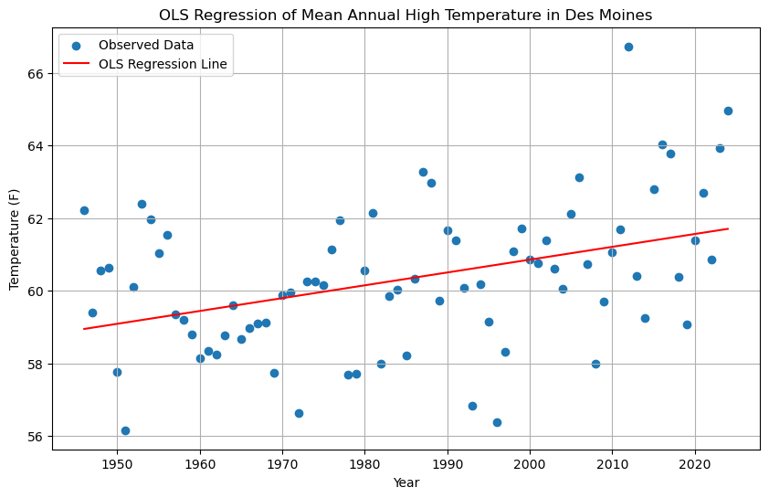

# About Me
Undergrad at CU Boulder, double major in Geography (GIS Concentration) and Atmospheric & Oceanic Science.

### Contact Info
- eli.smithberg@colorado.edu
- [LinkedIn](https://www.linkedin.com/in/eli-smithberg-b67bb9368/)
- [GitHub](github.com/smithberg)

***

# Portfolio

### Map of Pappajohn Sculpture Park in Des Moines, IA
<embed type="text/html" src="sculpture_park_interactive.html" width="600" height="600">

### Mean Annual High Temperatures in Des Moines, IA
The following plot displays the mean daily high temperature in Des Moines for every year from 1946 to 2024 (the full extent of the data, minus incomplete years). Data was collected from the Des Moines International Airport (<https://www.ncdc.noaa.gov/cdo-web/datasets/GHCND/stations/GHCND:USW00014933/detail>).
<iframe src="des moines temperature plot.html" width="800" height="250%" style="border:none;"></iframe>

To determine the historical trend of high temperatures in Des Moines, we can perform a **linear OLS regression** on the data, as shown in the following plot:

The OLS regression line gives an average increase in mean annual high temperature of 0.0353 degrees Fahrenheit per year from 1946 to 2024. With a t-statistic of t=3.908, the data strongly suggests that the temperature in Des Moines is increasing on average. This may be evidence of global warming, although the scope of the data is limited to Des Moines.
